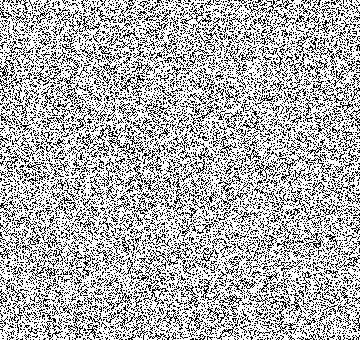
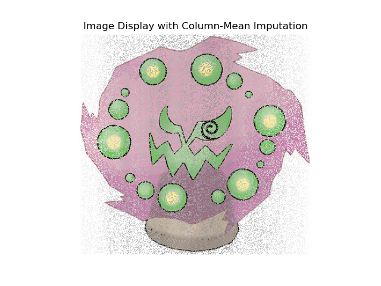
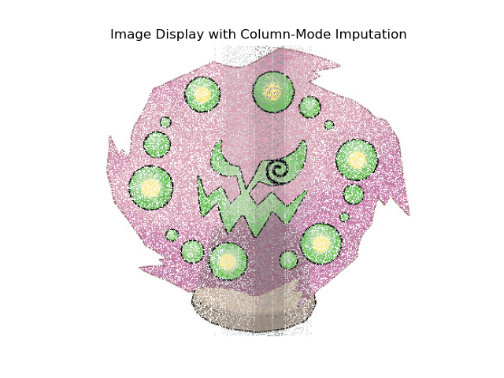
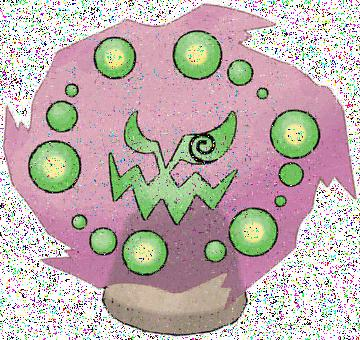
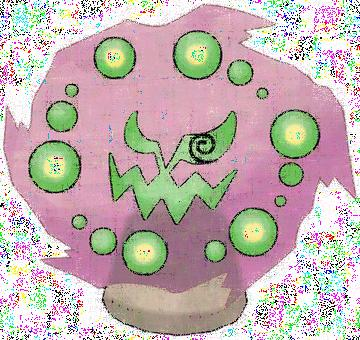
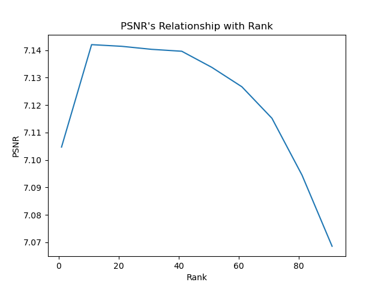
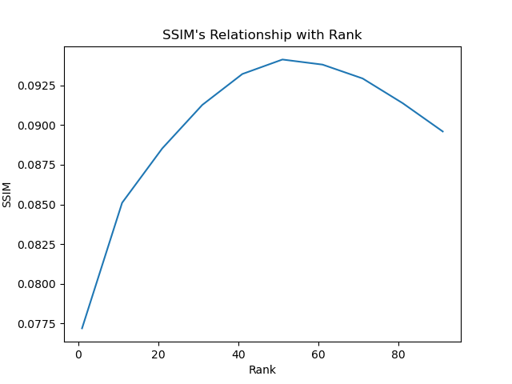
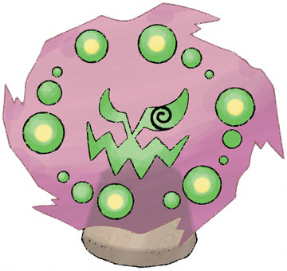

# Link to project presentation video:

https://www.awesomescreenshot.com/video/33205243?key=4d0521e571180edc44133689840d63e3

# Project Report: Evaluating Imputation Techniques for Image Restoration

In this project, I initially aimed to use the CIFAR-10 dataset to test various imputation techniques on corrupted images. However, CIFAR-10’s 32x32 resolution proved insufficient for visually assessing the restoration quality due to its low resolution. To facilitate more effective visual evaluations, I chose a higher-resolution dataset featuring images of Pokémon, with resolutions ranging between 280x210 and 400x400 pixels. This resolution provided the necessary detail to better analyze the imputation methods.

For this report, I focused on a single image, corrupted it, and then applied several imputation techniques to assess each method's effectiveness in restoring the image.

## Original and Corrupted Images

Below is the original image used in this experiment:

To simulate data corruption, I randomly selected a specified percentage of pixels and set those pixels to black.

To track which pixels were corrupted, I created a mask where `0` (white) indicates corrupted pixels, and `1` (black) represents uncorrupted pixels:

## Imputation Techniques and Evaluation Metrics

I applied various imputation techniques, including mean, median, mode, PCA, and Total Variation (TV) inpainting. Each technique was evaluated using both **Peak Signal-to-Noise Ratio (PSNR)** and **Structural Similarity Index (SSIM)**, alongside a visual assessment. PSNR measures the fidelity of the restored image, with higher values indicating closer resemblance to the original. SSIM evaluates structural similarity, with values close to 1 indicating high similarity.

### Mean, Median, and Mode Imputation Techniques

For each corrupted pixel, I replaced missing values based on the specified averaging technique (mean, median, or mode) calculated from the column values. Although I initially considered using a KNN variation, where I choose the nearest k pixels of the corrupted pixel to imputate the corrupted pixels, however this approach was computationally prohibitive.

Below are the visual results for the three imputation techniques:

- **Mean Imputation** yielded a PSNR of approximately 7.075 and an SSIM of 0.074. These values are low, suggesting poor fidelity and structural similarity with the original image. The resulting image looks patchy, indicating limited recovery quality.
  
- **Median Imputation** produced a similar result with a PSNR of ~6.924 and SSIM of ~0.073. The similarity in outcomes suggests minimal deviation between mean and median values across columns in this image.

- **Mode Imputation** performed slightly worse, with a PSNR of ~6.371 and SSIM of ~0.062. The imputed image displays noticeable "spotting" or white holes, likely due to blank spaces in those columns and the dense black area (the eye) in the center.

### PCA Imputation

Applying Singular Value Decomposition (PCA) allowed for low-rank approximations of the corrupted image, using ranks ranging from 1 to 91 with up to 50 iterations per rank. This method slightly improved PSNR and SSIM but introduced visible artifacts. Below are the images with the highest SSIM and PSNR values.

The image with the highest SSIM value (~0.094 at rank 51) performed better structurally compared to the previous techniques. While the internal structure is well-preserved, the outer areas display rainbow artifacts, likely due to reconstructing each RGB channel independently.

The best PSNR value (~7.142 at rank 11) produced a similar reconstruction with fewer artifacts within the shape but still showed rainbow-colored pixels in the background. This effect likely arises from independently reconstructing each color channel, resulting in color artifacts in blank areas where the low-rank approximation struggles.

I observed that the optimal recovery ranks differed between PSNR and SSIM, prompting me to explore how each metric varies with rank. The graphs below illustrate the relationship between rank and these evaluation metrics.

Interestingly, the relationship between SSIM and PSNR with rank follows a parabolic shape, peaking at different ranks. This suggests that structural similarity (SSIM) and fidelity (PSNR) may prioritize different aspects of the image.

### Total Variation Inpainting

Lastly, I applied Total Variation (TV) inpainting, which aims to minimize intensity variation while preserving edges. This method yielded the most promising results.

TV inpainting produced a nearly indistinguishable image from the original, with an PSNR of ~34.141, significantly outperforming the other methods. However, the SSIM was surprisingly low at ~0.096. This discrepancy can be attributed to:
- **Structural Sensitivity of SSIM**: SSIM is sensitive to small structural changes, and TV inpainting may smooth fine details or introduce minor edge shifts that affect the SSIM value.
- **Luminance and Contrast Differences**: TV inpainting might slightly adjust intensity and contrast levels, which can reduce SSIM, even if the overall image is visually similar.

### Testing on Real Images

I hypothesized that many of the artifacts such as rainbow scattering and the white and black spots are attributed to unrealistic images, so I decieded to test the different imputation techniques on some more realistic images. For an example, I chose an image of a cat

With the corrupted the image to be:

While testing mean, median, and mode imputation, I noticed that although we visually do not see much better performance, the SSIM and PSNR values rose significantly.

This is mean imputation, where we observed a SSIM and PSNR value of ~19.302 and an PSNR value of ~0.408. 

This is the median imputation, and here we begin to observe different results from the mean imputation technique. Here, we acquired an SSIM value of ~0.442 and a PSNR value of ~18.906. 

The mode imputation, however seems to be doing just as worse as it was with the unrealistic photos (relative to the other two imputated images). Testing on realistic images has led me to see that my hypothesis of the utilizing realistic images to minimize the visual artifacts (such as white splots) was false. 

Although it did not reduce the white spots, we see visually much better performance with PCA imputation. 

I calculated the SSIM to be ~33.030 and the SSIM value to be 0.932, which is considerably better than what we found for the unrealistic image. Here, we noticed much less rainbow scattering, with it only occuring in areas close to white. This observation soldified that rainbow scattering happens in areas close to (255, 255, 255). However a new artifact displayed in the left side (the red splotch). My guess is that it is SVD's tendency to reproduce dominant colors and structures across the image during reconstruction. Since the nose in the middle is the only object that is red, it might be considered a key pattern in the image. 

What was interesting was that the distribution of the relationship between the metrics (PSNR and SSIM) and rank changed.

We see that it doesn't necessarily follow a parabolic curve, but rather a unique distribution. It was particularly interesting that the max for both distributions resulted in a rank of 21 as well. 

Total variation in painting, as expected, did the best.

The PSNR was as expected (~41.802), however it was very interesting to note that the SSIM value was ~0.984, My guess is that since we don't have such harsh changes in the pixel values (like the white background or solid colors without blending based on light), we see considerable performance. 

## Future Directions

Moving forward, I plan to explore additional approaches and techniques:

- **Preprocessing with Averaging Techniques**: Applying mean, median, or mode imputation as a preprocessing step before PCA could potentially reduce the rainbow artifacting. Black pixels (0,0,0) in corrupted areas may be disproportionately influencing the approximation. By imputing these areas with average values first, I hope to achieve a more stable low-rank approximation.

- **Robust PCA**: I plan to investigate Robust PCA, which is reportedly effective in handling grossly corrupted observations. This method might handle corrupted pixels more gracefully, potentially reducing artifacts and improving both PSNR and SSIM.
- **Wavelet Transform-Based Inpainting**: Decomposing the image into wavelet components and targeting specific frequency bands for inpainting could allow for selective smoothing that retains texture and details.

- **Convolutional Autoencoders**: Using a pre-trained or custom-trained convolutional autoencoder to impute missing pixels could benefit complex patterns, learning image-specific features that improve imputation accuracy.

Each of these techniques could provide unique advantages in handling specific types of corruption or structures within images. My goal is to evaluate and compare these methods in terms of both visual quality and quantitative metrics like PSNR and SSIM to identify the most effective imputation strategies for image restoration.

To improve user interaction, I also aim to enhance my application’s functionality by allowing clients to manually select regions they wish to mark as "corrupted." This feature would give users control over which areas they want to visualize as restored. For instance, a user could select a lamppost in an image as the corrupted area and observe how Total Variation (TV) inpainting or other methods attempt to “remove” or restore that region.

## Citations

- [Image Restoration Using Convolutional Auto-encoders with Symmetric Skip Connections](https://arxiv.org/pdf/1606.08921v3)
- [Robust Principal Component Analysis](https://arxiv.org/pdf/0912.3599)
- [WaveFill: A Wavelet-based Generation Network for Image Inpainting](https://arxiv.org/pdf/2107.11027)
- [Understanding Image Quality Assessment Metrics: CR, PSNR, and SSIM](https://medium.com/@jradzik4/understanding-image-quality-assessment-metrics-cr-psnr-and-ssim-76ffa82d81ff)
- [Total variation in-painting](https://www.cvxgrp.org/cvx_short_course/docs/intro/notebooks/tv_inpainting.html)
